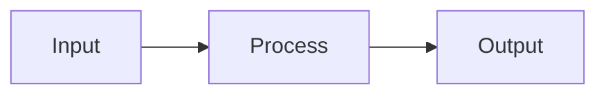

# <Topic Name>

## What It Does
One to three sentences. What this feature does from a product perspective — the capability it provides, the problem it solves, or the workflow it enables.

## How It Works
A mermaid or text diagram showing the product flow. Focus on what happens, not implementation details.

## Key Decisions

### <Decision Name>
**What:** What was chosen.
**Why:** Why it was chosen over alternatives. One or two sentences.

## Reference
File paths, commands, or config values someone would need to look up.
