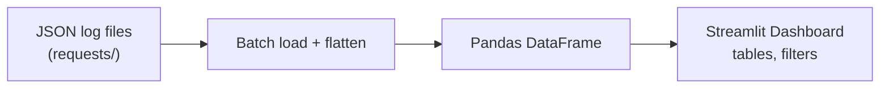

# Analytics Dashboard

## What It Does
Provides a visual interface for exploring Copilot request logs — see what's being sent, how often, and by whom. Built as a lightweight Streamlit app that reads log data and renders it as interactive dataframes.

## How It Works

1. Batch-loads `.json` files from the `requests/` directory
2. Flattens nested JSON structures into tabular format using `pandas.json_normalize()`
3. Renders the resulting dataframe in Streamlit's interactive table UI

## Key Decisions

### Streamlit for the UI
**What:** A single-file Streamlit app at `ui.py`.
**Why:** Minimal setup for dataframe visualization. No frontend build step, no JavaScript — just Python.

### Pandas for Data Processing
**What:** Pandas dataframes instead of a heavier analytics engine.
**Why:** The log volume is small enough that Pandas handles it comfortably. Integrates directly with Streamlit's `st.dataframe()`.

## Reference
- Dashboard: `ui.py`
- Run: `.\.venv\Scripts\python.exe ui.py`
