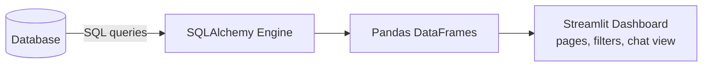

# Analytics Dashboard

## What It Does
Provides a visual interface for exploring Copilot proxy data — requests, messages, users, and routes. Built as a Streamlit app that queries the database directly and renders interactive pages.

## How It Works

```mermaid
flowchart LR
    DB[(Database)] -->|SQL queries| Engine["SQLAlchemy Engine"]
    Engine --> DF["Pandas DataFrames"]
    DF --> UI["Streamlit Dashboard<br/>pages, filters, chat view"]
```

1. Connects to the proxy database using a sync-compatible `DATABASE_URL`
2. Queries request logs, messages, users, and routes via SQL
3. Renders pages: Requests overview, Messages (chat view), Users, Routes

### Messages Page
Displays stored conversations as a chat interface. Messages are pre-processed by the proxy (text and XML metadata extracted), so the UI just renders `text` and iterates `meta_data` for expandable XML blocks.

## Key Decisions

### Streamlit for the UI
**What:** A multi-page Streamlit app under `services/copilot-ui/`.
**Why:** Minimal setup for dataframe visualization. No frontend build step, no JavaScript — just Python.

### Sync Database Driver
**What:** The UI uses a sync database URL (`postgresql+psycopg2://` or `sqlite:///`), not the async driver.
**Why:** Streamlit runs synchronously. Using `asyncpg` or `aiosqlite` causes `MissingGreenlet` errors. The UI config auto-converts async URLs to sync equivalents.

### Separate Configuration from Proxy
**What:** `services/copilot-ui/src/core/config.py` with its own `pydantic-settings` class.
**Why:** The UI runs as an independent process and cannot import from the proxy's `src.core`.

## Reference
- Dashboard: `services/copilot-ui/src/ui.py`
- Data layer: `services/copilot-ui/src/data.py`
- Config: `services/copilot-ui/src/core/config.py`
- Run: VS Code task "Run UI" or `uv run streamlit run src/ui.py`
