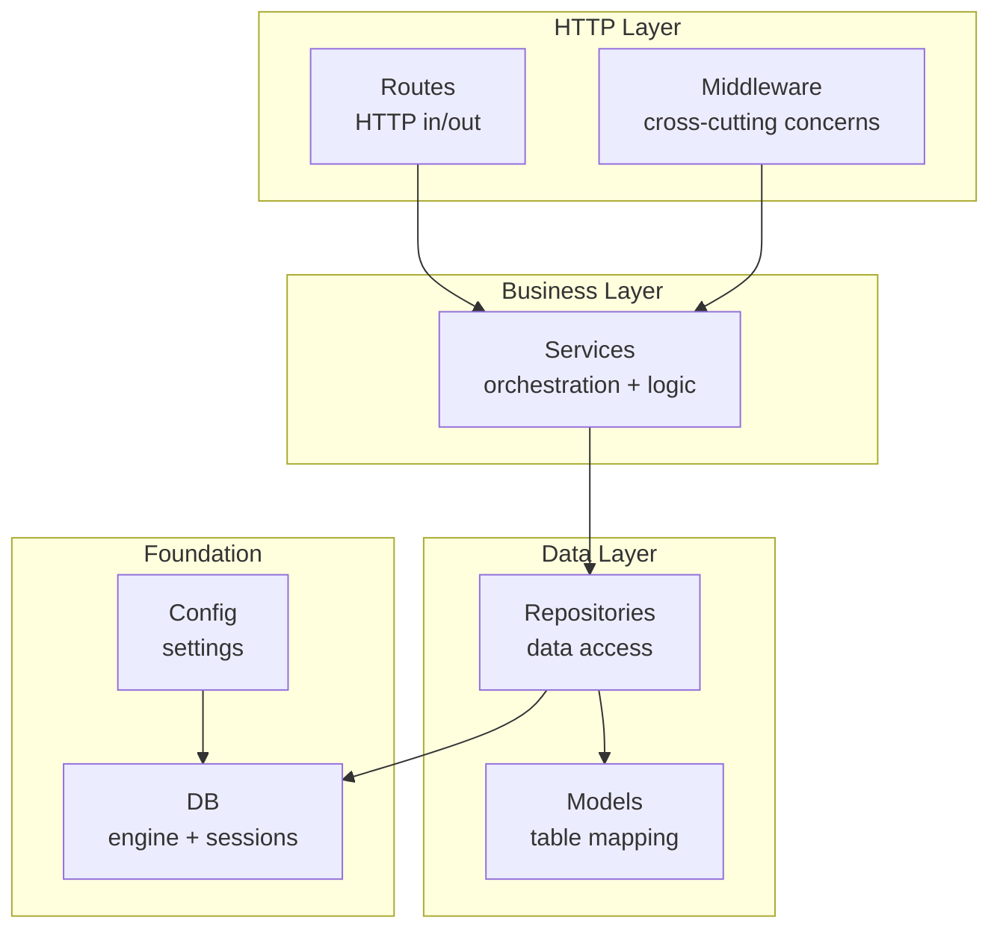
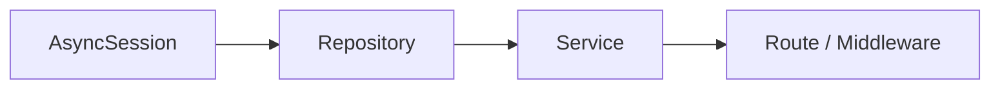

# Project Structure

## What It Does
Organizes the codebase into layers with clear responsibilities, so adding a new feature means adding files in the right package — not editing a monolith. Each layer only knows about the layer below it, making pieces independently testable and replaceable.

## How It Works

### Dependency Injection Chain

FastAPI's `Depends()` wires this automatically — each layer receives its dependencies without manual construction.

## Layer Responsibilities

| Layer | Does | Knows About |
|---|---|---|
| Route | HTTP in/out, validation | Service |
| Middleware | Cross-cutting (logging) | Service |
| Service | Business logic, orchestration | Repository |
| Repository | Database CRUD | Model, Session |
| Model | Table schema | Nothing |
| Config | Environment settings | Nothing |

## Key Decisions

### Layered Architecture from FastAPI Template
**What:** `src/` with `api/`, `core/`, `models/`, `repositories/`, `services/`.
**Why:** Follows the official FastAPI full-stack template, extended with repository and service layers for the proxy's logging needs.

### Repository Pattern with Generic Base
**What:** `BaseRepository[ModelType]` provides `create()` for free; entity-specific repos add custom queries.
**Why:** Centralizes database interaction patterns. New entities get CRUD automatically.

### Service Layer for Business Logic
**What:** `LoggingService` orchestrates request/response logging with UUID linking, parsing, and error handling.
**Why:** Routes stay thin. Repositories stay thin. Logic lives in one testable place.

### Package Re-exports via `__init__.py`
**What:** Each package exports its public symbols.
**Why:** Clean imports: `from src.models import RequestLog` instead of deep paths.

### Router Assembly in App Factory
**What:** `APIRouter` creation and `include_router` calls live in `src/main.py`'s `create_app()`. No separate `src/api/main.py`.
**Why:** The router aggregation file had no other responsibility. Inlining it removes a layer of indirection.

### Co-located Parsing Helpers
**What:** `parse_as_json` and `parse_as_sse` live in `src/services/logging.py`, not a separate utils module.
**Why:** `LoggingService` is the only consumer. Co-locating eliminates a single-consumer utils file.

## Reference
- App factory: `src/main.py`
- DI factories: `src/api/deps.py`
- Settings: `src/core/config.py`
- Database: `src/core/db.py`
