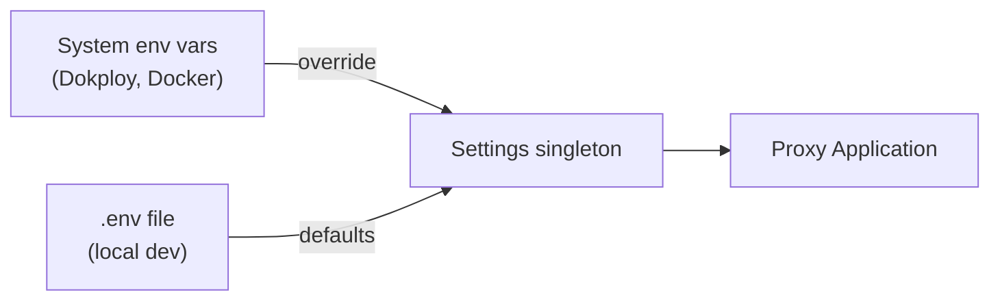

# Configuration

## What It Does
Provides a single place to control the proxy's behavior — which port to listen on, which database to use, which upstream APIs to forward to — without touching code. Settings come from a `.env` file locally or from Dokploy's environment injection in production.

## How It Works

System environment variables always win over `.env` file values. This means the same codebase runs locally (with `.env`) and in production (with Dokploy-injected vars) without changes.

## Settings

| Variable | Default | Purpose |
|---|---|---|
| `DATABASE_URL` | *(required)* | Database connection string |
| `LISTEN_HOST` | `0.0.0.0` | Server bind address |
| `LISTEN_PORT` | `8080` | Server bind port |
| `COPILOT_API_BASE_URL` | `https://api.githubcopilot.com/` | Upstream for Copilot API routes |
| `GITHUB_API_BASE_URL` | `https://api.github.com/` | Upstream for GitHub API routes |

## Key Decisions

### pydantic-settings for Type Safety
**What:** A `Settings` class with typed fields that auto-validate on startup.
**Why:** The proxy fails immediately if `DATABASE_URL` is missing or malformed, rather than crashing later with a cryptic error.

### 12-Factor Environment Hierarchy
**What:** System env vars override `.env` file values.
**Why:** Same code runs in all environments. Local devs use `.env`, production uses platform injection.

## Reference
- Settings class: `src/core/config.py`
- `.env` file at project root (git-ignored)
