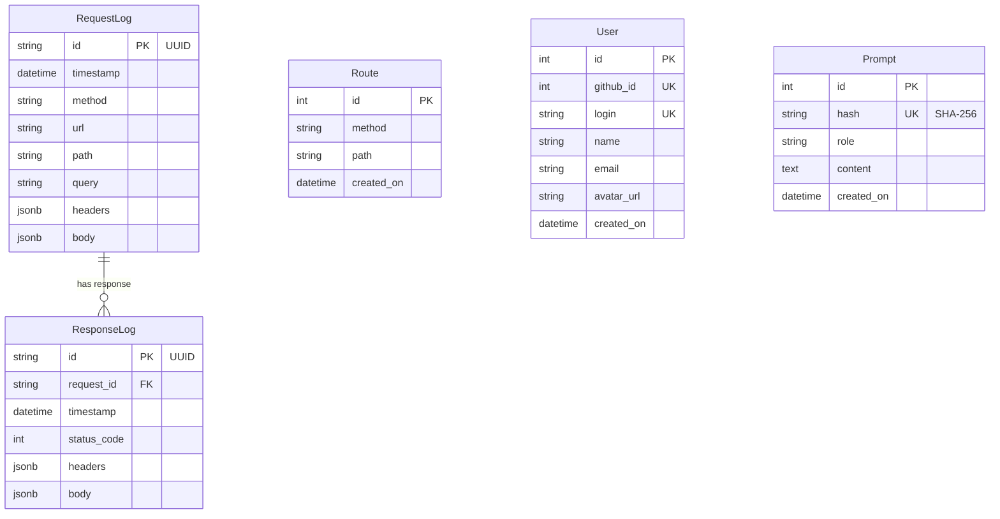
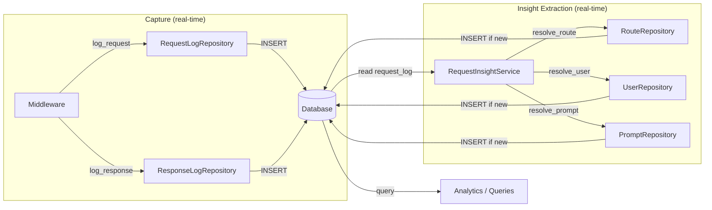

# Database

## What It Does
Stores every proxied request and response in a structured database, enabling queries like "show all completions from the last hour" or "find requests that returned errors." Each response is linked back to its originating request by UUID, so the full round-trip is always traceable. Derived entities (routes, users, prompts) are extracted from raw logs by the insight pipeline.

## How It Works

### Base Data (Immutable)
Request and response records are immutable base data. The capture path records raw HTTP traffic only.

### Derived Entities (Create-Once)
The insight pipeline runs after each request and extracts:
- **Routes** — unique method + path combinations, stored as the raw request path
- **Users** — resolved from `Bearer gho_` OAuth tokens via the GitHub API
- **Prompts** — system content extracted from `messages[0]` in request bodies, deduplicated by SHA-256 hash

Each entity is created once when first seen. No counters or timestamps are updated on repeat occurrences — recency and frequency can be computed from request logs via joins.

## Key Decisions

### PostgreSQL with Async Driver
**What:** SQLAlchemy async engine with `asyncpg`.
**Why:** The proxy must not block the event loop while writing logs. Async writes keep forwarding fast.

### JSONB for Headers and Bodies
**What:** Headers and body columns use PostgreSQL `JSONB`.
**Why:** Enables JSON path queries and indexing directly in the database — no application-level parsing needed to query payload contents.

### SQLite for Local Development
**What:** Swap `DATABASE_URL` to `sqlite+aiosqlite:///./copilot_proxy.db` for zero-dependency local development.
**Why:** No need to run PostgreSQL locally just to develop and test.

### UUID Request-Response Linking
**What:** Every request gets a UUID propagated to its response via `request.state.req_uuid`.
**Why:** The full round-trip must always be traceable — response alone is meaningless without the request that caused it.

### Repositories as Pure Data Access
**What:** Repositories handle only CRUD operations and queries — no business logic, no upserts, no counter increments.
**Why:** Keeps persistence separate from domain logic. Services own all business decisions and call repositories for storage.

### `created_on` Instead of Temporal Range
**What:** Entities have a single `created_on` timestamp, not `first_seen_at` / `last_seen_at`.
**Why:** `last_seen_at` is derived data — a MAX timestamp query against `request_logs` produces the same result. Storing it redundantly adds write overhead on every request.

### Raw Path as Route Identity
**What:** The route stored in the database is the raw request path. No regex normalization of dynamic segments.
**Why:** The proxy sees a manageable number of distinct paths. Pattern grouping can be done at query time rather than at ingestion time.

## Reference
- Database engine: `src/core/db.py`
- Models: `src/models/request_log.py`, `src/models/response_log.py`, `src/models/route.py`, `src/models/user.py`, `src/models/prompt.py`
- PostgreSQL URL: `postgresql+asyncpg://<user>:<pass>@<host>:5432/<db>`
- SQLite URL: `sqlite+aiosqlite:///./copilot_proxy.db`
