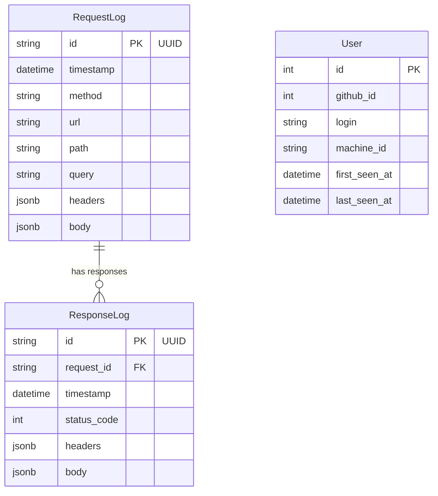
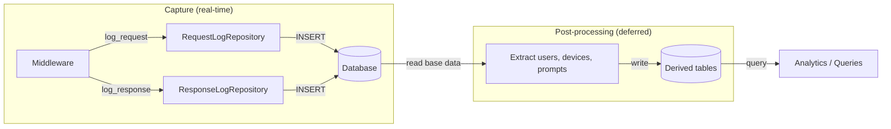

# Database

## What It Does
Stores every proxied request and response in a structured database, enabling queries like "show all completions from the last hour" or "find requests that returned errors." Each response is linked back to its originating request by UUID, so the full round-trip is always traceable.

## How It Works

### Capture vs Post-Processing
Request and response records are immutable base data. The capture path records raw HTTP traffic only — no user resolution, no device extraction, no prompt parsing. Enrichment happens in a separate post-processing step that reads the base records and derives higher-level entities.

### Capture Data Flow
1. Middleware intercepts a request and generates a UUID
2. Request details (method, URL, headers, parsed body) are written to `request_logs`
3. The UUID is passed to the response phase via `request.state`
4. Response details (status, headers, parsed body) are written to `response_logs` with the same UUID as foreign key
5. Both JSON and SSE payloads are parsed into structured JSONB for querying

### Post-Processing (planned)
A separate process reads base request/response records and extracts:
- **Users** — resolved from `vscode-machineid` and GitHub authorization headers
- **Devices** — derived from `user-agent`, `sec-ch-ua-platform`, `x-client-name`, `x-client-version`
- **Prompts** — extracted from request body payloads

## Key Decisions

### PostgreSQL with Async Driver
**What:** SQLAlchemy async engine with `asyncpg`.
**Why:** The proxy must not block the event loop while writing logs. Async writes keep forwarding fast.

### JSONB for Headers and Bodies
**What:** Headers and body columns use PostgreSQL `JSONB`.
**Why:** Enables JSON path queries and indexing directly in the database — no application-level parsing needed to query payload contents.

### Native DateTime Timestamps
**What:** Timestamp columns use `DateTime`, not strings.
**Why:** Enables time-range queries, indexing, and sorting without type-casting overhead.

### SQLite for Local Development
**What:** Swap `DATABASE_URL` to `sqlite+aiosqlite:///./copilot_proxy.db` for zero-dependency local development.
**Why:** No need to run PostgreSQL locally just to develop and test.

### Immutable Base Records with Deferred Enrichment
**What:** Request and response tables capture raw HTTP data only. Users, devices, and prompts are extracted in post-processing.
**Why:** Keeps the capture path simple and fast. Enrichment logic can evolve independently without risking the integrity of base data.

### UUID Request-Response Linking
**What:** Every request gets a UUID propagated to its response via `request.state.req_uuid`.
**Why:** The full round-trip must always be traceable — response alone is meaningless without the request that caused it.

## Reference
- Database engine: `src/core/db.py`
- Models: `src/models/request_log.py`, `src/models/response_log.py`
- PostgreSQL URL: `postgresql+asyncpg://<user>:<pass>@<host>:5432/<db>`
- SQLite URL: `sqlite+aiosqlite:///./copilot_proxy.db`
