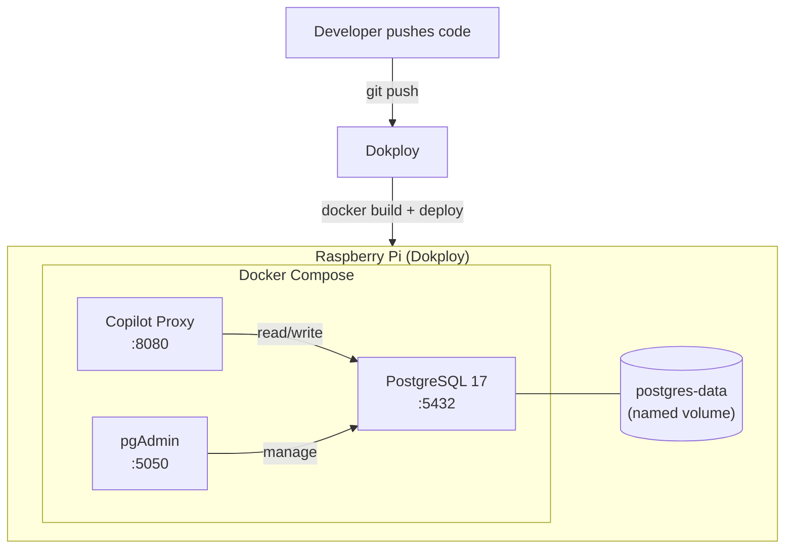
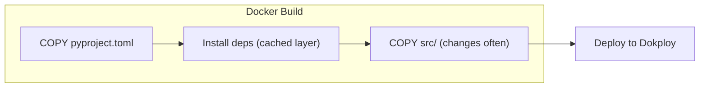

# Deployment

## What It Does
Packages the proxy as a Docker image that Dokploy can build and deploy on a self-hosted Raspberry Pi. The proxy, PostgreSQL, and pgAdmin run as a Docker Compose stack with persistent storage and auto-restart.

## How It Works

### Deployment Flow
1. Push code to the repository
2. Dokploy detects the change and builds a Docker image from the `Dockerfile`
3. Dependencies are cached in their own layer — source-only changes don't reinstall them
4. The image runs alongside PostgreSQL and pgAdmin in a Compose stack
5. Data persists across restarts via a named Docker volume
6. Containers auto-restart on crash or reboot

## Key Decisions

### Docker Image for Dokploy
**What:** A `Dockerfile` that produces a deployable image.
**Why:** Dokploy deploys via Docker images — this is the simplest and most reliable path to production on the Raspberry Pi.

### Dependency Layer Caching
**What:** Dependencies install before source code is copied.
**Why:** Most deploys are source-only changes. Caching the dependency layer makes builds fast.

### PostgreSQL 17 Alpine
**What:** `postgres:17-alpine` for the database.
**Why:** Small image (~80MB) suited for RPi. PG 17 uses the standard volume path; PG 18 changed it in a breaking way.

### Secrets via Environment Variables
**What:** Database credentials injected by Dokploy, never in compose files.
**Why:** Keeps secrets out of the repository. Dokploy handles injection at deploy time.

### pgAdmin Desktop Mode
**What:** Single-user mode without login.
**Why:** Private network only — no public access, so multi-user auth adds friction without benefit.

## Reference
- Dockerfile: `Dockerfile`
- Base image: `python:3.11-slim`
- App command: `python -m uvicorn src.main:app --host 0.0.0.0 --port 8080`
- DB connection: `postgresql+asyncpg://${POSTGRES_USER}:${POSTGRES_PASSWORD}@db:5432/${POSTGRES_DB}`
