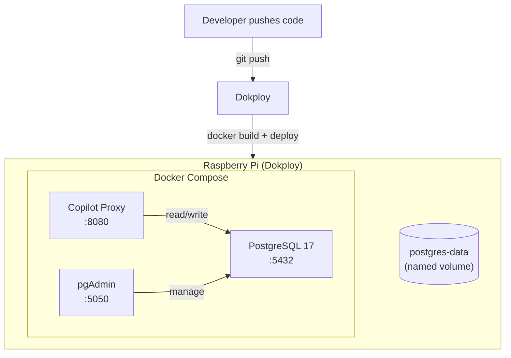
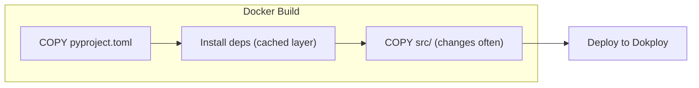
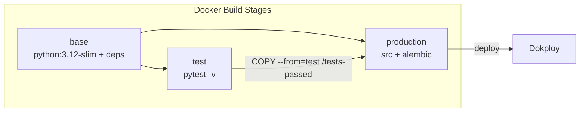

# Deployment

## What It Does
Packages the proxy as a Docker image that Dokploy can build and deploy on a self-hosted Raspberry Pi. The proxy, PostgreSQL, and pgAdmin run as a Docker Compose stack with persistent storage and auto-restart.

## How It Works


```mermaid
flowchart TD
    subgraph RPi["Raspberry Pi (Dokploy)"]
        subgraph Compose["Docker Compose"]
            Proxy["Copilot Proxy<br/>:8080"]
            PG["PostgreSQL 17<br/>:5432"]
            PGA["pgAdmin<br/>:5050"]
        end
        Vol[("postgres-data<br/>(named volume)")]
    end

    Dev["Developer pushes code"] -->|git push| Dokploy["Dokploy"]
    Dokploy -->|docker build + deploy| RPi
    Proxy -->|read/write| PG
    PGA -->|manage| PG
    PG --- Vol
```


```mermaid
flowchart LR
    subgraph Build["Docker Build"]
        A["COPY pyproject.toml"] --> B["Install deps (cached layer)"]
        B --> C["COPY src/ (changes often)"]
    end
    C --> D["Deploy to Dokploy"]
```

### Deployment Flow
1. Push code to the repository
2. Dokploy detects the change and builds a Docker image from the `Dockerfile`
3. Dependencies are cached in their own layer — source-only changes don't reinstall them
4. The image runs alongside PostgreSQL and pgAdmin in a Compose stack
5. Data persists across restarts via a named Docker volume
6. Containers auto-restart on crash or reboot

## Multi-Stage Build with Test Gate

No CI pipeline exists — the Docker build itself is the quality gate. If tests fail, the image never reaches Dokploy.


```mermaid
flowchart LR
    subgraph Stages["Docker Build Stages"]
        Base["base<br/>python:3.12-slim + deps"] --> Test["test<br/>pytest -v"]
        Base --> Prod["production<br/>src + alembic"]
        Test -->|COPY --from=test /tests-passed| Prod
    end
    Prod -->|deploy| Dokploy
```

| Stage | Purpose |
|---|---|
| `base` | Installs uv and runtime dependencies from `pyproject.toml` |
| `test` | Installs `[test]` extras, copies `src/` and `tests/`, runs `pytest`. Creates `/tests-passed` marker on success |
| `production` | Copies `src/`, `alembic/`, `alembic.ini`. Forces test stage via `COPY --from=test /tests-passed` |

The `COPY --from=test /tests-passed` line forces BuildKit to execute the test stage even though production doesn't otherwise depend on it. Without this, BuildKit skips unreferenced stages.

The production startup command runs migrations before accepting traffic:
```
CMD ["sh", "-c", "alembic upgrade head && exec python -m uvicorn src.main:app --host 0.0.0.0 --port 8080"]
```

## Key Decisions

### Docker Image for Dokploy
**What:** A `Dockerfile` that produces a deployable image.
**Why:** Dokploy deploys via Docker images — this is the simplest and most reliable path to production on the Raspberry Pi.

### BuildKit Test Gate
**What:** A `test` stage that runs pytest and produces a marker file copied into production.
**Why:** BuildKit skips stages not depended upon by the final target. The `COPY --from=test` trick forces execution. No CI server needed.

### Dependency Layer Caching
**What:** Dependencies install before source code is copied.
**Why:** Most deploys are source-only changes. Caching the dependency layer makes builds fast.

### In-Container Migrations
**What:** `alembic upgrade head` runs at container start, before the app.
**Why:** Schema changes deploy atomically with the code that requires them. No external migration script needed.

### PostgreSQL 17 Alpine
**What:** `postgres:17-alpine` for the database.
**Why:** Small image (~80MB) suited for RPi. PG 17 uses the standard volume path; PG 18 changed it in a breaking way.

### Secrets via Environment Variables
**What:** Database credentials injected by Dokploy, never in compose files.
**Why:** Keeps secrets out of the repository. Dokploy handles injection at deploy time.

### pgAdmin Desktop Mode
**What:** Single-user mode without login.
**Why:** Private network only — no public access, so multi-user auth adds friction without benefit.

## Reference
- Dockerfile: `services/copilot-proxy/Dockerfile`
- Base image: `python:3.12-slim`
- App command: `alembic upgrade head && python -m uvicorn src.main:app --host 0.0.0.0 --port 8080`
- DB connection: `postgresql+asyncpg://${POSTGRES_USER}:${POSTGRES_PASSWORD}@db:5432/${POSTGRES_DB}`
