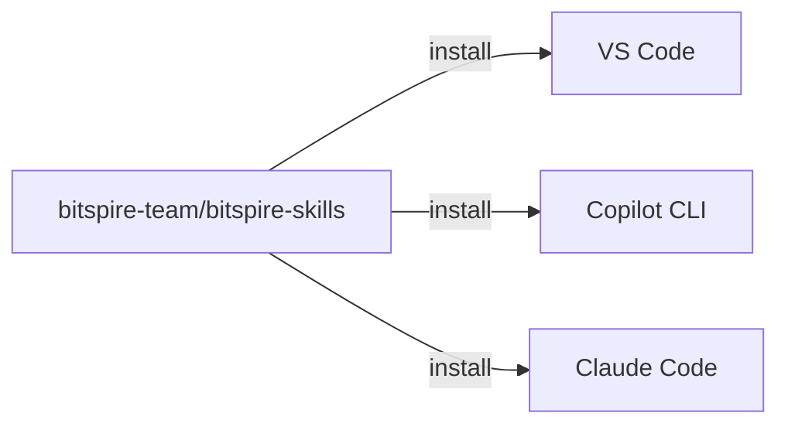

# Plugin Distribution

## What It Does
Distributes the self-learning skills (document-learning-draft, compact-documentation) as installable Copilot Agent Plugins via a dedicated public repository. Any project or team can install the skills without copying files.

## How It Works



The plugin repository is structured as a marketplace monorepo:

```text
bitspire-team/bitspire-skills/
├── .github/plugin/marketplace.json
├── plugins/
│   └── self-learning/
│       ├── plugin.json
│       └── skills/
│           ├── document-learning-draft/
│           └── compact-documentation/
├── README.md
└── LICENSE (MIT)
```

### Install Commands

| Tool | Command |
|---|---|
| VS Code | `Chat: Install Plugin From Source` → paste repo URL |
| Copilot CLI | `copilot plugin install bitspire-team/bitspire-skills:plugins/self-learning` |
| Claude Code | `claude plugin add bitspire-team/bitspire-skills` |
| Org-wide | `chat.plugins.marketplaces: ["bitspire-team/bitspire-skills"]` in shared settings |

VS Code auto-checks for updates every 24 hours. Copilot CLI uses `copilot plugin update`.

## Key Decisions

### Git Repository Over npm Registry
**What:** A public GitHub repo as the distribution format.
**Why:** Copilot CLI and VS Code agent plugins are Git-native (`owner/repo` install path). npm adds `package.json` boilerplate for what is just Markdown files. Private distribution is free via org membership.

### Marketplace Monorepo Over One-Repo-Per-Skill
**What:** Single repo with `plugins/` subdirectories.
**Why:** One registration gives access to all plugins. Adding a new plugin is just a new folder. Users can still install individual plugins via subdirectory path.

### Public Repository
**What:** Public visibility, MIT license.
**Why:** Zero auth management. Community feedback via GitHub Issues. Private is trivial to switch to later (flip visibility, org members retain access).

## Reference
- Plugin repository: `bitspire-team/bitspire-skills`
- Registry file: `.github/plugin/marketplace.json`
- Plugin manifest: `plugins/<name>/plugin.json`
