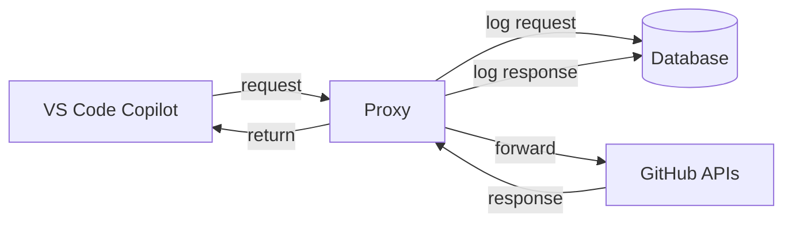
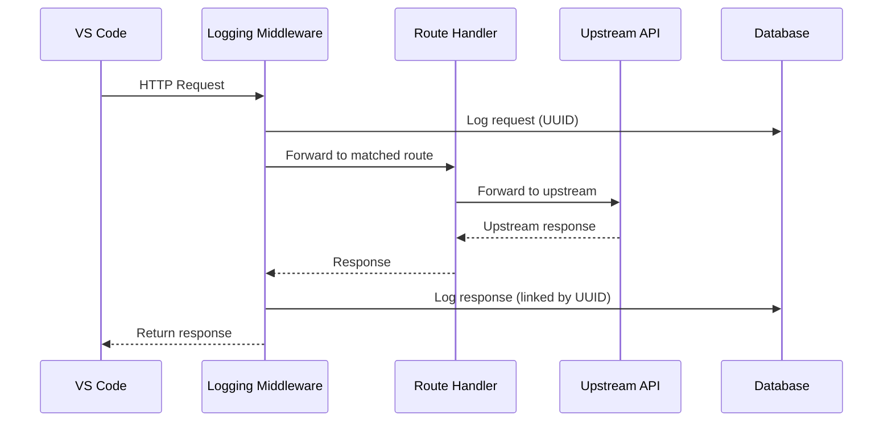
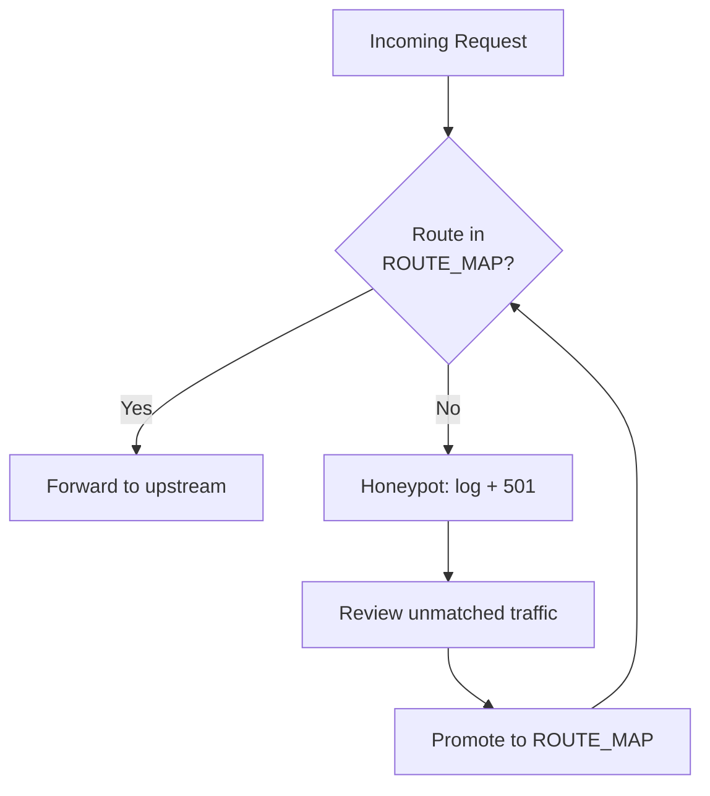

# Proxy Service

## What It Does
Sits between VS Code Copilot and GitHub's APIs, transparently forwarding all traffic while capturing every request and response for analytics. Developers use Copilot normally — the proxy is invisible to them — while the team gains full visibility into what Copilot sends and receives.

## How It Works

### Request Lifecycle

### Route Discovery Flow

Known routes are explicitly registered in a route map. Unknown traffic lands in a honeypot — it's logged for analysis and can be promoted to an explicit route once understood. Nothing is silently dropped.

## Routing

### Copilot API Routes (`api.githubcopilot.com`)
| Method | Path |
|---|---|
| POST | `/chat/completions` |
| POST | `/v1/messages` |
| POST | `/v1/engines/gpt-41-copilot/completions` |
| GET | `/models` |
| POST | `/models/session` |

### GitHub API Routes (`api.github.com`)
| Method | Path |
|---|---|
| GET | `/agents/sessions` |
| GET | `/agents/swe/v1/jobs/{owner}/{repo}/enabled` |
| GET | `/agents/swe/custom-agents/{owner}/{repo}` |
| GET | `/agents/swe/models` |
| GET | `/agents` |

### How Routes Are Identified
VS Code sends different traffic depending on the debug setting:
- `debug.overrideCapiUrl` → Copilot API traffic (completions, models, sessions)
- `debug.overrideProxyUrl` → GitHub API traffic (agents, auth)

## Local Development

Run the proxy using the **Run Proxy** VS Code task, which executes `.venv\Scripts\python.exe src\main.py` and displays FastAPI output in the terminal.

If startup fails with `WinError 10048` on `0.0.0.0:8080`, another process is already holding the port. Check for stale proxy instances or other services before assuming a code problem.

Authorization headers reveal the target: `Bearer gho_*` → GitHub OAuth, `Bearer tid=*` → Copilot session.

## Key Decisions

### Explicit Route Map Over Catch-All
**What:** Routes are registered from a `ROUTE_MAP` list, not a single wildcard.
**Why:** Different VS Code settings send traffic to different upstreams. A catch-all that blindly rewrites URLs would misroute requests and produce opaque 400 errors.

### Honeypot for Unknown Traffic
**What:** Unmatched requests are logged and return 501 instead of being silently dropped.
**Why:** Enables iterative route discovery — run the proxy, check what lands in the honeypot, promote new routes.

### HTTP/2 on Upstream Client
**What:** Outbound connections use HTTP/2 with automatic HTTP/1.1 fallback.
**Why:** Multiplexing and header compression improve throughput for concurrent requests to GitHub APIs.

### Middleware-Based Logging
**What:** All request/response capture happens in middleware, not in route handlers.
**Why:** Forwarding routes stay minimal and single-purpose. Logging is a cross-cutting concern.

### SSE and JSON Payload Parsing
**What:** Payloads are parsed as JSON first, with SSE detection for streaming responses.
**Why:** Structured storage enables querying individual completion events from the database.

## Reference
- Route map: `src/api/routes/proxy.py`
- Health probes: `src/api/routes/health.py` (`/live`, `/health`)
- Logging middleware: `src/middleware/logging.py`
- Logging service: `src/services/logging.py`
