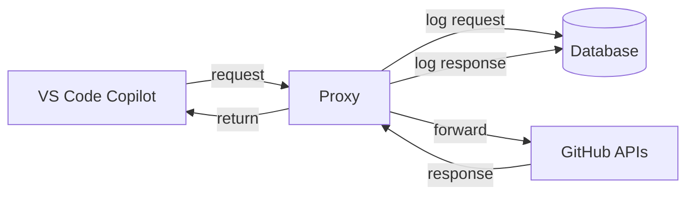
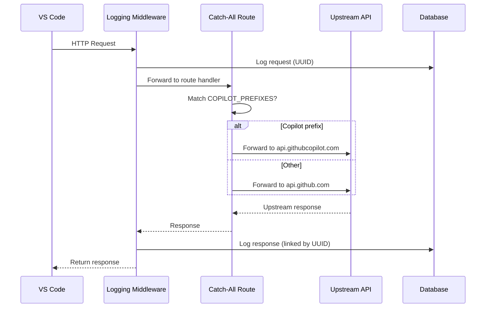

# Proxy Service

## What It Does
Sits between VS Code Copilot and GitHub's APIs, transparently forwarding all traffic while capturing every request and response for analytics. Developers use Copilot normally — the proxy is invisible to them — while the team gains full visibility into what Copilot sends and receives.

## How It Works

### Request Lifecycle

## Routing

A single catch-all route (`/{path:path}`) forwards all requests. The upstream is chosen by matching the request path against `COPILOT_PREFIXES`:

| Prefix | Upstream |
|---|---|
| `/_ping` | `api.githubcopilot.com` |
| `/v1/` | `api.githubcopilot.com` |
| `/chat/` | `api.githubcopilot.com` |
| `/responses` | `api.githubcopilot.com` |
| `/models` | `api.githubcopilot.com` |
| `/agents` | `api.githubcopilot.com` |
| *(everything else)* | `api.github.com` |

New upstream endpoints work automatically — no proxy changes needed unless a path requires a different upstream.

### VS Code Debug Settings
VS Code sends different traffic depending on the debug setting:
- `debug.overrideCapiUrl` → Copilot API traffic (completions, models, sessions)
- `debug.overrideProxyUrl` → GitHub API traffic (agents, auth)

## WebSocket Support
The proxy includes `websockets` as a dependency so uvicorn can handle WebSocket upgrade requests. The VS Code Copilot client attempts a WebSocket upgrade after `POST /responses` to receive streaming events. Without this, the upgrade fails and the client falls back to HTTP polling that the upstream rejects.

## Local Development

Run the proxy using the **Run Proxy** VS Code task, which executes `.venv\Scripts\python.exe -m uvicorn src.main:app --host 0.0.0.0 --port 8080 --reload`.

If startup fails with `WinError 10048` on `0.0.0.0:8080`, another process is already holding the port.

## Key Decisions

### Transparent Catch-All Over Explicit Route Map
**What:** A single `/{path:path}` route forwards all traffic, using `COPILOT_PREFIXES` to select the upstream.
**Why:** An explicit route map required manual additions every time the Copilot client introduced a new endpoint. The transparent approach eliminates that maintenance.

### HTTP/2 on Upstream Client
**What:** Outbound connections use HTTP/2 with automatic HTTP/1.1 fallback.
**Why:** Multiplexing and header compression improve throughput for concurrent requests to GitHub APIs.

### Middleware-Based Logging
**What:** All request/response capture happens in middleware, not in route handlers.
**Why:** Forwarding routes stay minimal and single-purpose. Logging is a cross-cutting concern.

### SSE and JSON Payload Parsing
**What:** Payloads are parsed as JSON first, with SSE detection for streaming responses.
**Why:** Structured storage enables querying individual completion events from the database.

## Reference
- Catch-all route: `src/api/routes/proxy.py`
- Health probes: `src/api/routes/health.py` (`/live`, `/health`)
- Logging middleware: `src/middleware/logging.py`
- Logging service: `src/services/logging.py`
