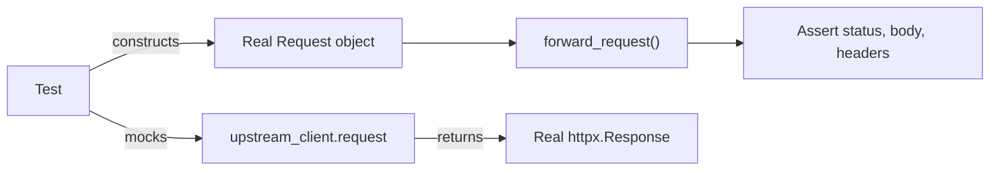

# Proxy Unit Testing

## What It Does
Verifies that the proxy correctly forwards requests to upstream APIs — URL rewriting, header filtering, body passthrough, streaming responses, and error handling — without making real network calls or needing authentication tokens.

## How It Works

### Test Strategy
- Build real `Request` and `Response` objects (they're stateless, no side effects)
- Mock only the one thing that makes network calls: `upstream_client.request`
- Assert that the proxy correctly transforms inputs to outputs

## Test Cases

| Test | Verifies |
|------|----------|
| `test_forwarding_get_requests` | URL rewriting, header filtering, status/body/media-type mapping |
| `test_forwarding_post_requests_with_payload` | Body bytes forwarded untouched to upstream |
| `test_forwarding_post_requests_with_streaming_response` | SSE content-type and raw bytes pass through correctly |
| `test_exception_handling` | Upstream failures produce 502 with error message |

## Key Decisions

### Real Objects Over Mocks
**What:** `Request` and `httpx.Response` are real instances, not mocks.
**Why:** Tests validate actual data flow. `MagicMock(spec=Request)` broke on `request.url.path` because plain strings lack `.path`.

### Mock Only Network Calls
**What:** Only `upstream_client.request` is patched.
**Why:** Minimizes assumptions. Everything else exercises real code paths.

### Inline Test Construction
**What:** ASGI scope dicts are built inline per test, no shared helpers.
**Why:** Each test is self-contained and readable. The scope dict is only 5 keys.

## Reference
- Test file: `tests/test_proxy.py`
- Source under test: `src/api/routes/proxy.py` → `forward_request()`
- Run: `.\.venv\Scripts\python.exe -m pytest tests/test_proxy.py`
