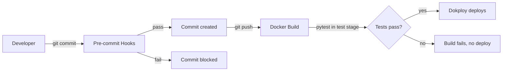

# Quality Gates

## What It Does
Enforces code quality at two checkpoints — commit time and build time — without a CI server. Pre-commit hooks catch issues in seconds locally; the Docker test gate catches anything that slips through before the image deploys.

## How It Works

### Pre-commit Hooks

Configured in `.pre-commit-config.yaml` using the [pre-commit framework](https://pre-commit.com/):

| Hook | What It Does | Scope |
|---|---|---|
| `gitleaks` | Scans for leaked secrets | All files |
| `pytest-proxy` | Runs full proxy test suite | Always (all tests, not just changed files) |
| `ruff-check` | Lint check | Staged Python files |
| `ty-check` | Type check | Staged Python files |
| `ruff-format` | Auto-format (manual stage) | Only when explicitly requested |

The `pytest-proxy` hook uses `require_serial: true` to prevent parallel test suites causing race conditions. It runs with `pass_filenames: false` because the full suite must pass, not just changed-file tests.

The `ruff-format` hook uses `stages: [manual]` so it only runs via `pre-commit run --hook-stage manual ruff-format`, not on every commit.

### Docker Test Gate

The Dockerfile `test` stage runs `pytest -v` during image build. If any test fails, the build fails and Dokploy never receives the image. See [Deployment](deployment.md) for the multi-stage build details.

### VS Code Tasks

| Task | Command |
|---|---|
| Run Pre-commit (All Files) | `uv run pre-commit run --all-files` |
| Test Proxy | `uv run pytest` (in `services/copilot-proxy/`) |

## Key Decisions

### Pre-commit Framework Over Raw Git Hooks
**What:** `.pre-commit-config.yaml` with the pre-commit framework.
**Why:** Version-controlled config, portable across developers, declarative, isolated environments.

### Full Test Suite on Every Commit
**What:** `pytest-proxy` runs all tests, not just tests for changed files.
**Why:** Catches regressions immediately. The test suite runs in seconds so there is no speed penalty.

### Registered pytest Marks
**What:** Custom marks like `integration` are declared in `[tool.pytest.ini_options]`.
**Why:** Eliminates `PytestUnknownMarkWarning` and enables `pytest --markers` for discovery.

## Reference
- Pre-commit config: `.pre-commit-config.yaml`
- Setup: `uv sync && pre-commit install`
- Run all hooks: `uv run pre-commit run --all-files`
- pytest config: `services/copilot-proxy/pyproject.toml` (`[tool.pytest.ini_options]`)
