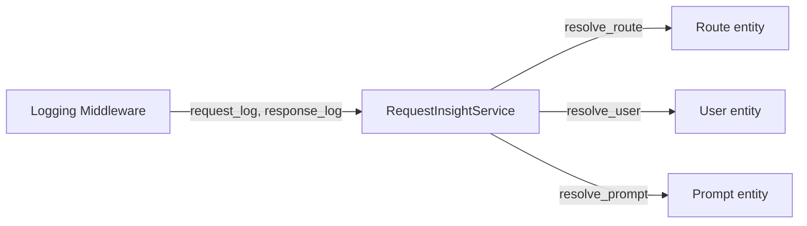

# Request Insights

## What It Does
Extracts structured entities from raw request logs — routes, users, and prompts — so the team can answer questions like "which endpoints does Copilot call?", "who is using Copilot?", and "what system prompts are in use?" without manually parsing log data.

## How It Works

The insight pipeline runs synchronously after each request/response pair is logged. Each resolve method checks if the entity already exists — if not, it creates it. No updates on repeat occurrences.

### Route Resolution
Stores the raw HTTP method + path. No regex normalization or dynamic segment replacement.

### User Resolution
Triggers only on `Bearer gho_` OAuth tokens. Calls `GET https://api.github.com/user` to fetch the GitHub profile (login, name, email, avatar). Requests with `tid=` Copilot session tokens are skipped — these contain tracking metadata (SKU, IP, feature flags) but no user identity.

### Prompt Resolution
Reads `messages[0].content` from the request body. Handles both string content and list-of-parts content. Deduplicates by SHA-256 hash of the content string.

## Key Decisions

### Single Service for All Extractions
**What:** `RequestInsightService` owns route, user, and prompt resolution in one class.
**Why:** User resolution was originally a separate service. Merging it eliminated indirection — the resolve methods share the same "create if not exists" pattern and operate on the same request log data.

### `gho_` Tokens Only for User Identity
**What:** Only `Bearer gho_` tokens trigger user resolution via the GitHub API.
**Why:** `tid=` tokens are opaque session identifiers with no API to resolve a user. The `gho_` token is the only reliable path to a GitHub profile.

### `messages[0]` for System Content
**What:** System content is always read from `messages[0].content`, with no role check or top-level `system` fallback.
**Why:** Copilot API payloads consistently place the system prompt at index zero. Role-scanning and fallback logic handled hypothetical formats that don't occur in practice.

## Reference
- Insight service: `src/services/request_insight.py`
- Route model: `src/models/route.py`
- User model: `src/models/user.py`
- Prompt model: `src/models/prompt.py`
