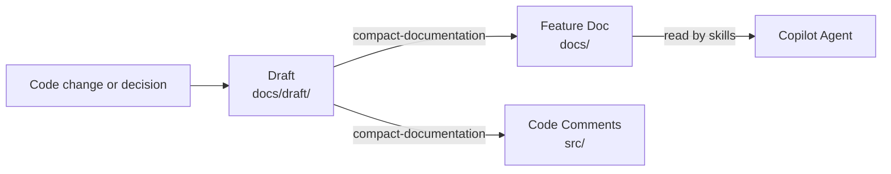

# Self-Improvement Learnings Loop

## What It Does
Makes the AI agent accumulate project knowledge over time. When the team makes a technical decision or solves a problem, the learning is captured as a draft and compacted into feature documentation. During compaction, localized technical details move into code comments instead of docs — keeping documentation high-level and code self-documenting.

## How It Works

### The Loop
1. A problem is solved or a technical decision is made
2. The `document-learning-draft` skill captures a dated draft in `docs/draft/`
3. The `compact-documentation` skill squash-merges drafts into `docs/`
4. During compaction, localized details are added as code comments instead of going into the doc
5. Stale or superseded drafts are deleted

### What Goes Where

| Detail type | Destination | Example |
|---|---|---|
| Product-level what/why, architecture, cross-cutting decisions | Feature doc (`docs/`) | Data flow diagrams, route tables, config overview |
| Localized rationale for a specific code choice | Code comment (`src/`) | Why a timeout value was chosen, workaround for a framework quirk |

## Key Decisions

### Two Skills Only
**What:** `document-learning-draft` + `compact-documentation` handle the full workflow.
**Why:** A dedicated third skill was explored and rejected — it added complexity without benefit.

### Code Comments Over Documentation for Local Details
**What:** During compaction, technical details localized to one code location become code comments, not doc entries.
**Why:** Keeps feature docs scannable and high-level. Developers find local rationale where they need it — next to the code.

### `docs/` as Single Accumulator
**What:** All drafts live under `docs/draft/`, all compacted docs directly under `docs/`.
**Why:** One place for all knowledge. Feature docs are the source of truth.

### Draft-First Rule
**What:** Files under `docs/` are never edited directly. All changes start as a draft in `docs/draft/`, and only the `compact-documentation` skill writes to `docs/`.
**Why:** Direct edits bypassed the learning loop — changes to finalized docs were not tracked as individual decisions. Enforcing draft-first preserves the timeline.

### Flat Docs Structure
**What:** Feature docs are `.md` files directly under `docs/`. Only use a subfolder when a feature has child pages (e.g., `docs/proxy-service/`).
**Why:** A `docs/features/` wrapper and per-feature subfolders added nesting without value. Most features are single-page docs.

### GitHub Pages with Just the Docs
**What:** `docs/_config.yml` uses `just-the-docs/just-the-docs@v0.10.1` remote theme with dark color scheme. Drafts are excluded from the build.
**Why:** Auto-generates sidebar navigation from YAML frontmatter (`title`, `nav_order`). Adding a new doc only requires frontmatter — no manual index to maintain.

## Reference
- Draft skill: `.github/skills/document-learning-draft/SKILL.md`
- Compact skill: `.github/skills/compact-documentation/SKILL.md`
- Drafts: `docs/draft/`
- Feature docs: `docs/`
